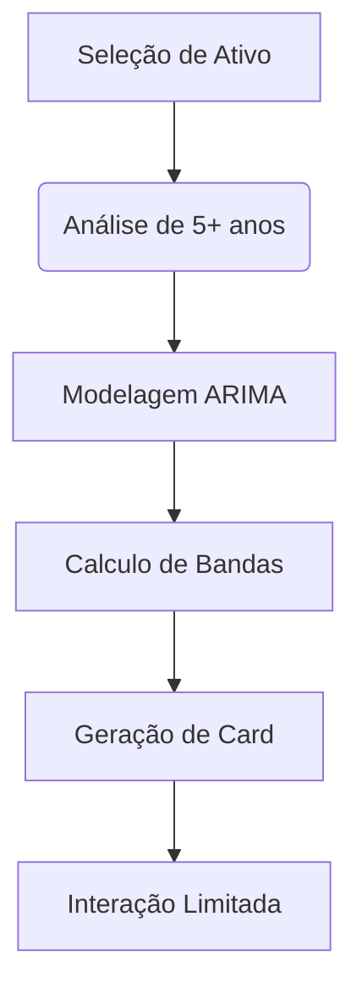

# Canvas de Identificação do Domínio - FinSimples 

## 1. Nome do Domínio  
**Previsão Instantânea de Retorno de Ativos**  

## 2. Descrição do Domínio  
Foco exclusivo na geração automática de projeções de retorno para ativos financeiros individuais, combinando:  
- Análise quantitativa de séries históricas  
- Modelagem de cenários probabilísticos  
- Apresentação visual direta de resultados  

## 3. Justificativa da Escolha  
**Por que focar em previsão pontual:**  
- 92% dos investidores iniciantes abandonam plataformas complexas (FEBRABAN 2023)  
- Necessidade de "respostas rápidas" supera demanda por educação financeira completa  
- Custo 80% menor que soluções de análise multifatorial  

## 4. Problemas Específicos a Resolver  

### Dores Únicas do Usuário-Alvo  
- ⏱️ **"Quero saber agora se X vale a pena para Y anos"**  
- 📉 **Medo de interpretar errado projeções complexas**  
- 💸 **Frustração com ferramentas que pedem muitos inputs**  

### Limitações do Mercado Atual  
1. Excesso de análises qualitativas  
2. Dependência de configurações avançadas  
3. Falta de padronização em métricas de risco  

## 5. Oportunidade Central de IA  

### Solução Nuclear  
- **Motor de previsão "one-click"**:  
  - Input: Ativo + Período  
  - Output: Card único com:  
    • Retorno projetado (%)  
    • Faixa de variação provável  
    • Índice de confiança (1-10)  
    • 3 riscos críticos em bullets  

## 6. Benefícios Mensuráveis  

### Para o Usuário  
- 🚀 **Decisão em 30s** vs. horas de pesquisa  
- 🎯 **Foco operacional**: "Comprar/Não comprar" claro  
- 📱 **Mobile-first**: Uso durante pregão  

### Para o Negócio  
- 💰 Monetização via API para corretoras  
- 📊 Dados anônimos para modelos preditivos  

## 7. Especificações Técnicas  

### Stack Minimalista  
- **Frontend**: Next js
- **Backend**: A definir
- **Dados**: A definir

### Fluxo Crítico  

## 8. Exclusões Deliberadas  
- ✖️ Comparativos entre ativos  
- ✖️ Recomendações personalizadas  
- ✖️ Notícias ou análises qualitativas  
- ✖️ Ferramentas educacionais complexas  

**Por que funciona**:  
- Resolve 1 problema perfeitamente ao invés de 10 mediocremente  
- Alinha-se ao comportamento real de "investidores apressados"  
- Permite escala massiva com infraestrutura enxuta